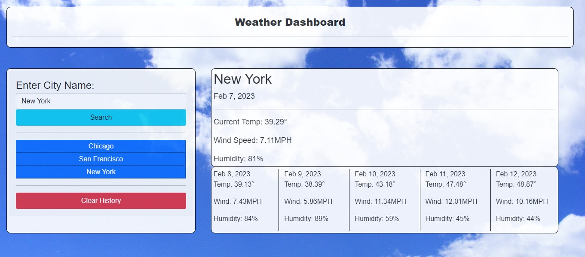

Weather Dashboard

In this project I created a weather app that allows the user to retreive weather data. The user will input which city/town they want data for and click search. This will fetch data from the API (https://openweathermap.org/forecast5) and display it on the page. The data listed includes temperature, wind speed, and humidity for the current day and the following 5 days. The API dayjs was also used to determine the day for each forecast data. 

[GitHub Repository](https://github.com/MattOz/Weather-Dashboard)

[GitHub Live Link](https://mattoz.github.io/Weather-Dashboard/)

